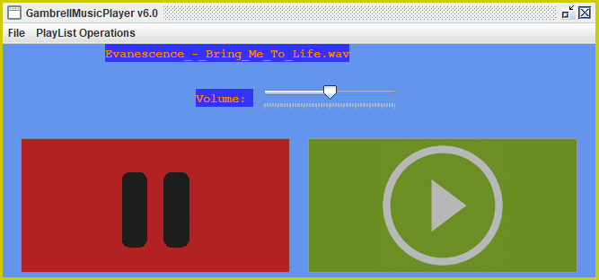

# GambrellMusicPlayer

GambrellMusicPlayer is a Java-based (MP3/WAV) music player that I developed in my time
at Grayson High School. The program makes use of the older Java AWT and Swing
libraries alongside the now-defunct javazoom audio library.

**Note**: This program is archive and will not be continued.
